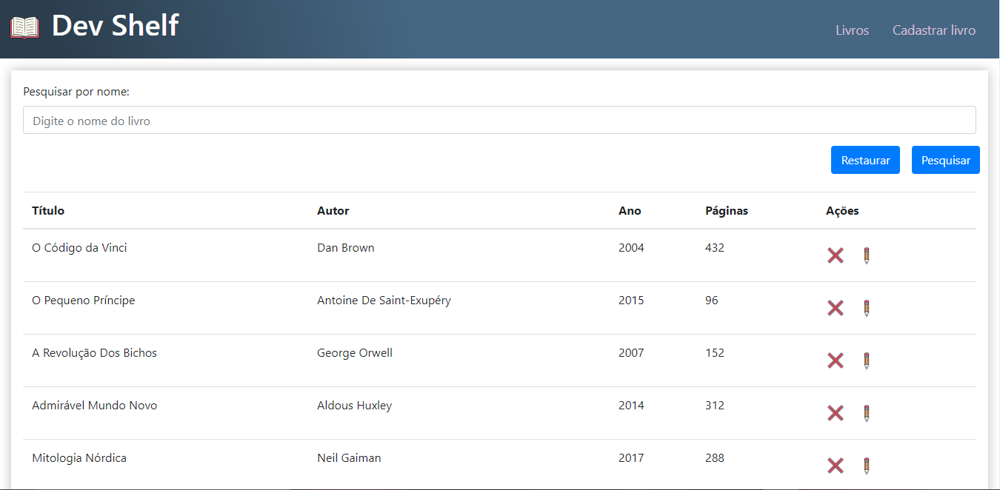
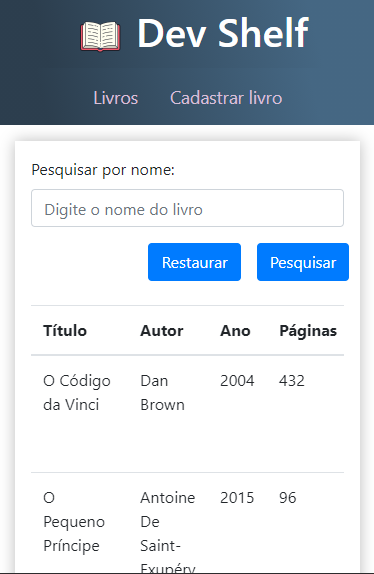

<h1 align="center">Dev Shelf</h1>

	
  

  

  

   Projeto desenvolvido para estudo e aprimoramento de habilidades com a biblioteca do ReactJs. E Desenvolver uma aplicação envolvendo uma stack completa, inclusive com banco ded dados.

  <a href="#clipboard-sobre-o-projeto">Sobre o Projeto</a>&nbsp;&nbsp;&nbsp;|&nbsp;&nbsp;&nbsp;
  <a href="#computer-tecnologias-utilizadas">Tecnologias</a>&nbsp;&nbsp;&nbsp;|&nbsp;&nbsp;&nbsp;
  <a href="#information_source-how-to-use">How To Use</a>&nbsp;&nbsp;&nbsp;|&nbsp;&nbsp;&nbsp;
  <a href="#closed-book-licença">Licença</a>

  

  

## :clipboard: Sobre o Projeto

Um Sistema simples para consulta e visualização de dados sobre livros, permitindo o usuário consultar, adicionar, remover, e editar informações sobre livros.

## :computer: Tecnologias utilizadas

O projeto foi desenvolvido utilizando as seguintes tecnologias:

- ReactJs
- React Router
- Bootstrap
- PostgreSQL
- Axios
- Express

## :information_source: How To Use

- Clone este repositório: `git clone https://github.com/CauaLW/dev-shelf`
- No shell do PostgreSQL execute o código localizado em `backend/scriptDataBase.sql` para criar o banco e a tabela
- Em `backend/db/book.js` configure as opções para poder acessar o seu banco
- Vá até o repositório: `cd dev-shelf`
- Entre no backend: `cd backend`
- Instale as dependências para o backend: `npm i`
- Inicie o backend: `npm start`
- Saia do backend: `cd ..`
- Entre no frontend: `cd frontend`
- Instale as dependências para o frontend: `npm i`
- Inicie o frontend: `npm start`
- As portas são 3000 para o frontend, e 3001 para o backend (Express com PostgreSQL)

## :closed_book: Licença

Esse projeto está sob a licença MIT. Veja o arquivo [LICENSE](https://github.com/CauaLW/dev-shelf/blob/master/LICENSE) para mais detalhes.
